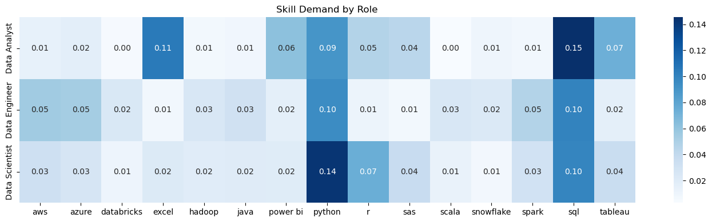
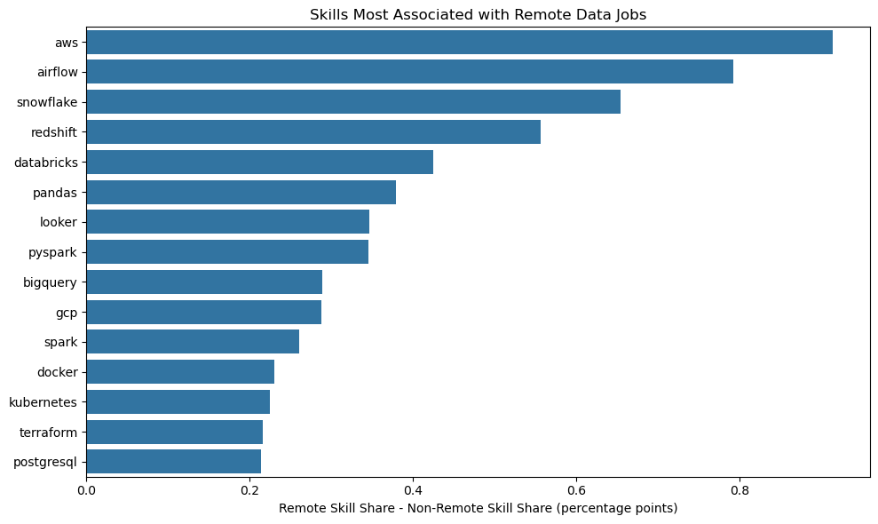
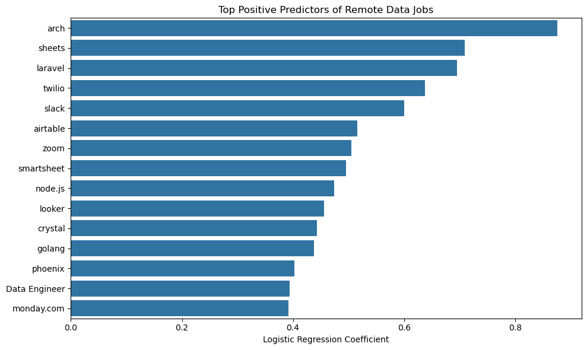

# Data Job Market Analysis

## Project Overview

This project analyzes nearly 785,000 data-related job postings from 2023 to explore how technical skill requirements differ across Data Analyst, Data Engineer, and Data Scientist roles. The analysis focuses on skill demand, remote work trends, role specialization, and the technologies most associated with remote-friendly jobs.

## Tools & Technologies

- Python
- Pandas — data cleaning and preprocessing
- NumPy — numerical operations
- Matplotlib & Seaborn — data visualization
- Scikit-learn — logistic regression modeling and evaluation
- Jupyter Notebook — exploratory analysis and modeling

## Data Quality Assesment

The dataset contains ~785k job postings across 17 columns related to job metadata, skills, location, remote work, and compensation. Initial inspection showed that most core fields had very high completeness, particularly job_title_short, job_posted_date, job_work_from_home, company_name, and geographic columns.

A missing value audit revealed that salary-related columns had extremely low coverage (salary_year_avg 97.2% missing, salary_hour_avg 98.64% missing). Salary disclosure rates were consistently low across job roles and countries, making compensation analysis prone to selection bias. Because of this, the project focus shifted away from salary prediction and toward labor market trends, skill demand, and remote work analysis.

Skill-related fields remained highly usable, with only ~14.9% missing values in job_skills and job_type_skills. Duplicate analysis using company, title, and location showed a low duplicate rate (~0.2%), suggesting reposted jobs would have minimal impact on overall trends.

The dataset spans the full 2023 calendar year and is primarily concentrated in three major roles: Data Analyst, Data Engineer, and Data Scientist, which became the main focus of subsequent analyses.

## Processing and Analysis

The job_skills column was originally stored as strings instead of actual Python lists, so the skills first had to be parsed and cleaned before analysis. After converting the values into lists, the column was exploded into a separate dataframe (skills_df) where each row represented one skill tied to a job posting. Skills were also standardized by converting them to lowercase and removing extra whitespace.

Once cleaned, overall skill frequencies were analyzed. SQL and Python were the two most common skills across the dataset, followed by cloud and data engineering tools such as AWS, Azure, Spark, and Databricks.

To better understand how technical requirements differ across careers, the analysis focused on the three largest job categories in the dataset:

1. Data Analyst
2. Data Engineer
3. Data Scientist

A heatmap was then created using normalized skill frequencies to compare the most common skills across these roles. The results showed clear differences between them:

Data Analysts were more associated with Excel, Tableau, and Power BI
Data Engineers showed stronger demand for AWS, Spark, Kafka, and Airflow
Data Scientists were more closely tied to Python, R, and machine learning tools

This analysis helped highlight how different areas of the data field require different technical skill sets.

## Remote Work Analysis

Remote work patterns were analyzed across the three largest job categories in the dataset: Data Analyst, Data Engineer, and Data Scientist. The percentage of remote postings was calculated for each role, showing noticeable differences in how frequently remote work appeared across areas of the data industry.

To better understand the relationship between skills and remote work, skill frequencies were compared between remote and non-remote job postings. Skill counts were normalized within each group to account for differences in total posting volume, allowing for a fair comparison of how commonly each skill appeared in remote positions.

The analysis showed that cloud and modern data engineering technologies such as AWS, Snowflake and Airflow appeared more frequently in remote job postings.

## Key Findings

The analysis revealed clear differences in skill requirements across the three largest data roles: Data Analyst, Data Engineer, and Data Scientist. Data Analyst postings were more strongly associated with business intelligence and reporting tools such as Excel, Tableau, and Power BI, while Data Engineer roles emphasized cloud and infrastructure technologies including AWS, Spark, Kafka, and Airflow. Data Scientist roles showed stronger associations with programming and machine learning tools such as Python, Pandas, PyTorch, and Hugging Face.

Remote work analysis showed that modern engineering and cloud-based technologies appeared more frequently in remote job postings. Skills such as AWS, Databricks, Airflow, Slack, Zoom, and Pandas were positively associated with remote roles, while more traditional enterprise and business-focused tools showed weaker associations with remote work.

A logistic regression model was also trained to predict whether a job posting was remote using skill and role information. While the model achieved moderate predictive performance (ROC-AUC ≈ 0.63), it successfully identified meaningful patterns linking modern engineering workflows and collaborative cloud technologies with remote-friendly jobs. However, remote postings represented less than 10% of the dataset, creating a noticeable class imbalance that likely limited predictive performance.

Overall, the project suggests that the modern data job market is highly specialized, with distinct technical ecosystems emerging across analytics, engineering, and data science roles. At the same time, remote opportunities appear to be more concentrated in cloud-driven and engineering-heavy areas of the field.

## Limitations

Several limitations should be considered when interpreting the results. Salary-related columns contained extremely high levels of missingness, making compensation analysis unreliable and prone to selection bias. Additionally, extracted skill data may contain parsing inconsistencies or rare noisy skill labels. Job postings also represent employer demand rather than actual hiring outcomes, and the dataset does not include information such as seniority level, years of experience, or company size, all of which may influence remote work patterns and technical requirements.

## Data Source

This project uses the ["data_jobs"](https://huggingface.co/datasets/lukebarousse/data_jobs) dataset available on Hugging Face. The dataset contains approximately 785,000 job postings collected throughout 2023 and includes information related to job titles, skills, locations, remote work status, schedule type, and salary data where available.

